<p align="center">
  
</p>

### `$ cat about.yml`

```yaml
name: Kenneth Park
most_recent_role: Full-Stack Software Developer @ Rutgers CUPR, Data Informatics Group
current_role: Student @ Rutgers University
education: B.A. Computer Science, minor in Data Science @ Rutgers (Jan 2027)
interests: [full-stack web apps, REST APIs, data pipelines, automated testing]
```

### `$ ghfetch`


### `$ ./snake ~/contributions`

<picture>
  <source media="(prefers-color-scheme: dark)" srcset="https://raw.githubusercontent.com/Aye-Shun/Aye-Shun/output/snake-dark.svg">
  
</picture>

### `$ league --stats`

<a href="https://www.deeplol.gg/summoner/na/Ecionisakiri-9767"></a>

<sub>Stats from <a href="https://www.deeplol.gg/summoner/na/Ecionisakiri-9767">deeplol.gg</a>. Not endorsed by Riot Games. League of Legends and Riot Games are trademarks or registered trademarks of Riot Games, Inc.</sub>

### `$ ls ~/languages`



### `$ ls ~/frameworks`



### `$ ls ~/tools`



### `$ ls ~/projects`

| project | stack | what it does |
| :-- | :-- | :-- |
| **Stock Market Sentiment Analyzer** | `Python` `SQL` | Pipeline that collects financial news headlines into SQL, scores their sentiment with NLP and compares it to stock movement |
| **Multithreaded Chat App** | `Java` | Client–server messaging over Java sockets with concurrent clients, user authentication and message logging |
| **League of Legends Match Predictor** | `Python` `Riot API` | Pulls match history from the Riot API and runs regression on team comp and gold income to predict outcomes |
| **[Game Boy Emulator](https://github.com/Aye-Shun/Tests)** | `Python` | Emulator core with an opcode dispatch table, CPU flag helpers and a fetch → decode → execute loop |

### `$ open linkedin`

<a href="https://www.linkedin.com/in/kennethpark14"></a>

<sub><code>[process completed]</code></sub>
