  

  <a href="https://www.linkedin.com/in/kennethpark14">LinkedIn</a> &nbsp;·&nbsp;
  <a href="https://github.com/Aye-Shun?tab=repositories">Repositories</a>

I'm Kenneth, a Computer Science student at Rutgers University with a minor in Data Science. I build web apps, APIs, and data tools, with an interest in clear interfaces and automated testing.

Previously a **Full-Stack Software Developer** with Rutgers CUPR's Data Informatics Group. Expected graduation: **January 2027**.

### `$ ls ~/projects`

| Project | Stack | What you'll find |
| :-- | :-- | :-- |
| **[Lanewise](https://github.com/Aye-Shun/lanewise)** | Swift · SwiftUI | A native macOS League of Legends companion with lobby scouting, match history, and an in-game overlay. |
| **[Bookmark API](https://github.com/Aye-Shun/bookmark-api)** | Python · FastAPI · SQLite | A persistent REST API with URL validation, tag filtering, pagination, and API tests. |
| **[CSV Quality Check](https://github.com/Aye-Shun/csv-quality-check)** | Python | A CLI that reports missing values, duplicate records, and numeric ranges, with JSON output for scripts. |
| **[Study Session CLI](https://github.com/Aye-Shun/study-session-cli)** | JavaScript · Node.js | A local study log with calendar validation, weekly summaries, and tests using Node's built-in runner. |

### `$ cat stack.yml`

| Area | Technologies |
| :-- | :-- |
| Languages | Python · JavaScript · Java · SQL · C · R |
| Web & APIs | React · FastAPI · Node.js · Vite |
| Data | PostgreSQL · Pandas · NumPy · T-SQL |
| Development | Git · Docker · pytest · Jupyter |

<strong><code>$ ghfetch</code> — GitHub activity</strong>

 

<picture>
  <source media="(prefers-color-scheme: dark)" srcset="https://raw.githubusercontent.com/Aye-Shun/Aye-Shun/output/snake-dark.svg">
  
</picture>

<strong><code>$ ls ~/other-work</code> — more projects</strong>

 

Additional work and experiments:

- **Stock Market Sentiment Analyzer** — Python and SQL pipeline for collecting financial headlines, scoring sentiment, and comparing it with stock movement.
- **Multithreaded Chat App** — Java socket-based client/server messaging with concurrent clients, authentication, and message logging.
- **League of Legends Match Predictor** — Python project using Riot API match history to explore team composition and gold income.
- **[Game Boy experiments](https://github.com/Aye-Shun/Tests)** — an early Python emulator skeleton with CPU flag helpers and an opcode-dispatch loop.

<strong><code>$ cat off-duty.md</code> — games & music</strong>

 

Outside of development, I play League of Legends and listen to music.

Stats from <a href="https://www.deeplol.gg/summoner/na/Ecionisakiri-9767">deeplol.gg</a>. Not endorsed by Riot Games. League of Legends and Riot Games are trademarks or registered trademarks of Riot Games, Inc.

